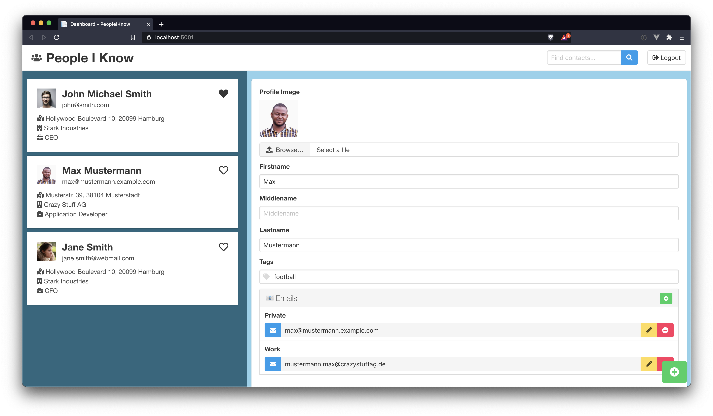
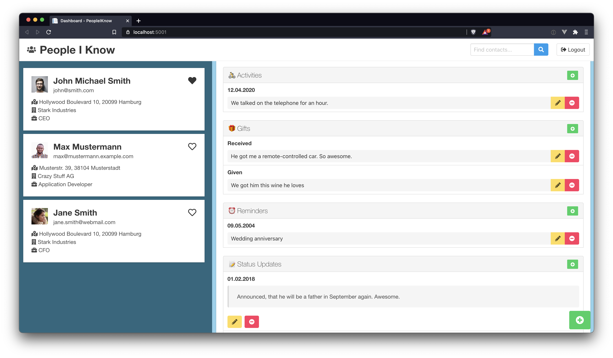

# People I Know
"People I Know" is a PRM.

## What is a PRM?
A PRM is a "Personal Relationship Management". On the web, you will also find the name "Personal CRM".
So you can use "People I Know" to store information about the people you know. ;-)

### Is it like my "Contacts" app on my phone?
Yes, somehow it is.

### So, why would I use it?

There were a few reasons for me to build this application. For "normal" contact management, the standard android or iOS
app would be fine. But there was something missing for me.

1. If you use the before mentioned services, you don't own your data. It is stored somewhere in Apples or Googles Cloud services.
2. The standard apps / services do not provide good possibilities to store some kind of timeline / updates for the contacts. You still have the "Notes" field, but it is limited to a multi-line text.
3. At least in Google Contacts you can store "Relationships" of a contact to other people. But that feature is also limited to a key-value-pair. No real links to other contacts etc.

So the main goal of this application is to do standard contact management plus

1. You own your data. It is stored in **your** database.
2. You can store "Status Updates" on your contacts. Such an entry consists of a date and a multi-line text. Of course
   the updates are sorted by date automatically.
3. You can store relationships to other people (just like in Google). But in the near future I will implement the
   possibility to link to other contacts.

## Features

Right now the features are pretty limited. But the app is under (more or less) active development. So current features
are

* Adding status updates to your contacts
* Adding information about given and received gifts, as well as ideas for gifts
* Adding, changing and deleting eMail addresses, telephone numbers, activities and relationships on contacts
* Save information about your common activities (chats, calls, dates, etc.)
* Add tags to your contacts
* Searching contacts by name and tags

### Relationships

In the past, one of my main problems always was remembering the relationships between various people.
"What was the name of Johns son again?", "Is Mark a cousin of Lisa or a cousin of Noah?".

Today, I just check the respective contact and see the relationships to other people in seconds. Just like in your
Google contacts, you can store relationships on all of your contacts. It's just a simple list of "Relationship - Name"
pairs, like "Wife - Jane Smith".

### Status Updates / Timeline

"People I Know" makes it easy for you, to keep track of recent things in the life of your friends/contacts. Just add
updates to the "timeline" of your contacts. Before you meet your friends again, just check their contact in "People I
Know" and you can ask about the exam they had a week ago or about the broken leg of their brother.

### Common activities

Store information about common activities with your contacts. No more "When was the last time we met Carl?". Just
check "People I Know" and you will instantly know it.

### Gifts

Sometimes it is hard to remember what you got someone as a birthday present last year. Or you are looking for a gift for
Michael and this one book would be perfect for him. But you are not sure if it was Anne or Michael who gave it to you
for your birthday.

That's why you can keep track of gifts in "People I Know". Keep track of presents anyone gave you, presents you gave to
your contacts, or even ideas for presents.

## Something is missing?

Are you missing some kind of feature? You are welcome to create an issue here in the GitHub repo. Let's discuss it and
see if it would benefit other people as well.

Or even better: After creating the issue, fork the repo, implement the feature and send me a pull-request. :-)
